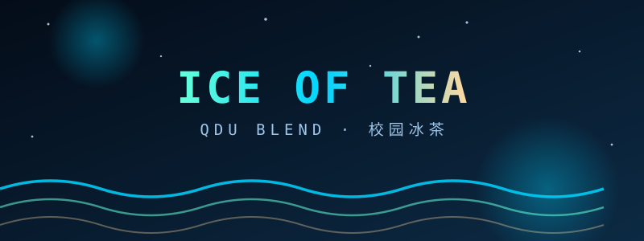
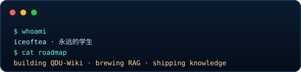

  <b>「 一瓶冰茶，一座校园，一整个知识库 」</b> 
  永远的学生。

## 🍵 身份卡 · ID Card

<b>一盏茶的时间，认识我</b>

 

| 栏目 | 内容 |
|:--:|:--|
| 🎓 **出身** | 青岛大学 · 计算机科学技术学院 · 软件工程（创新班） |
| 🍵 **副业** | 前青岛大学贴吧吧主· 校园社区运营 |
| 🔭 **雷达** | 全栈 Web · Agent 开发 · 机器学习 |
| ⚙️ **手感** | C/C++ · Java · Python · Vue3 · Spring Boot |
| 📊 **实践** | OpenCode · Claude Code · Hermes · Codex |

## 💻 Tech Stack

**🧊 Languages**

      

**🍵 Backend / Database**

   

**🧠 AI / ML**

   

**🧰 Tools / OS**

   

**🤖 Agent 工具链**

   

## 🏆 代表作 · QDU-Wiki（2026.07）

牵头把贴吧沉淀下来的校园经验，搭成一座**活着的 Wiki**：
新生手册、生活指南、学习学业、校园服务、学院详情……由 MkDocs 构建，托管在 GitHub Pages，向每一位 QDUer 开放 PR。

  
  

- 🧊 **社区驱动**：从贴吧走出来的内容，再喂回给 Wiki，形成正循环。
- 🤖 **Agent 协作**：设计了「提示词工程」维护流程，让 AI 也能帮忙改词条。

## 🎓 隐藏仓库 · 校园论坛 + RAG 问答机器人

独立从底层搭建的校园论坛网站（Spring Boot + Vue3），核心亮点是自研的 **RAG 智能问答机器人**：

<pre>
      ┌──────────────┐      ┌──────────────┐      ┌──────────────┐
      │   Vue 3      │ ───► │ Spring Boot  │ ───► │    RAG bot   │
      │  frontend    │      │   backend    │      │   QA robot   │
      │  forum UI    │      │   REST API   │      │  vector match │
      └──────────────┘      └──────────────┘      └──────────────┘

        [ split ] ─► [ embed ] ─► [ retrieve ] ─► [ rerank ] ─► [ generate ]
         分块         向量化          检索            优化          生成
</pre>

- 🧩 **模块化设计**：业务逻辑清晰分层，独立可扩展。
- 🔍 **语义匹配**：基于 Sentence-Transformers，识别相似帖子的语义而非关键词。
- 💬 **智能回复**：发布提问后，AI 依据优化后的上下文自动生成回答。

## 🧪 我的配方表

| 分类 | 配料 | 用途 |
|:--:|:--|:--|
| 🔩 **引擎** | C · C++ · Java · Python | 拧紧每一处算法细节 |
| 🍵 **后端** | Spring Boot · MySQL · REST API | 让每个接口都稳稳上桌 |
| 🕸 **前端** | Vue3 · HTML · JS · WXML · WXSS · PHP | 界面与交互，一杯见底 |
| 🧠 **AI** | RAG · Sentence-Transformers · PyTorch | 让知识会自己说话 |
| 🧰 **工具** | Git · Linux · MkDocs · Office | 后勤补给线 |

## 🏆 淬炼记录

- 🥇 **蓝桥杯** · 第十三届 山东赛区 C/C++ 程序设计大学 B 组（三等奖） 鉴定为烂
- 🤖 **RAICOM** · 2023 睿抗机器人开发者大赛 山东赛区（三等奖） 鉴定为烂
- 🎓 **奖学金 ×6**：校一等 ×2 · 二等 ×2 · 三等 ×1 · 洲固校友企业奖学金 ×1
- 🌟 **荣誉称号**：优秀毕业生 · 优秀学生干部 · 优秀团干部 · 优秀团员 · 先进团支部

## 🍵 社区足迹

- 🏛 **青岛大学贴吧吧主**：管过流量，也管过节奏，最后把经验写成 Wiki。
- 👥 **团支书**：带领支部获评「先进团支部」（其实是领着一班兄弟玩了四年）。
- 🧭 **辅导员助理 / 带班**：两届新生，从报到到融入。

## 🧭 航线图 · 正在学

  <kbd>RAG / Agent</kbd>
  <kbd>Machine Vision</kbd>
  <kbd>Remote Sensing</kbd>
  <kbd>ROS 2</kbd>

## 📮 灯塔 · 找到我

  
  

## 📟 终端一角

---

  <samp><small><i>* 把踩过的坑都泡开，后来的人就不再迷路。 *</i></small></samp>

